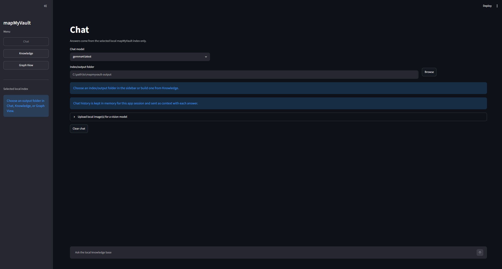
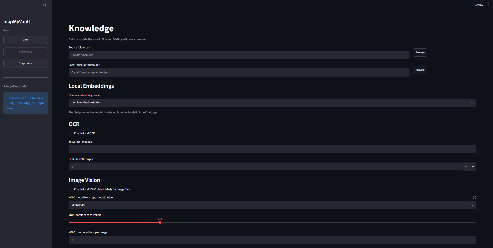
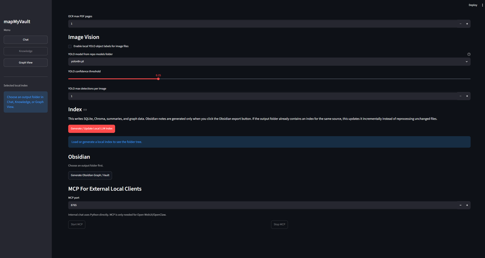
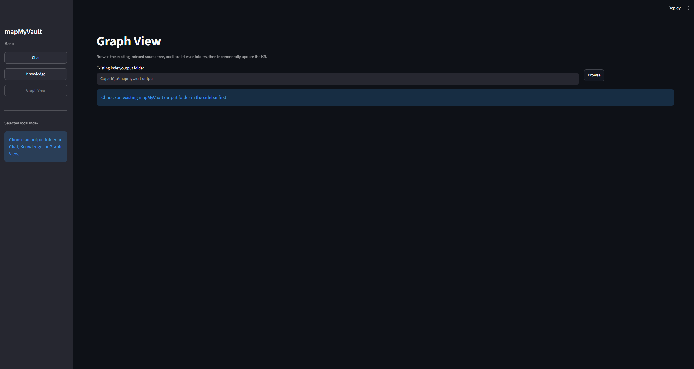

# mapMyVault

mapMyVault turns a local folder into a private, searchable knowledge base for local LLMs.

It indexes files on your own machine, stores the results in SQLite, builds a local vector index, and can export a mirrored Obsidian folder for human browsing. It is designed for local document search, local chat, inspectable evidence, and no source data leaving your device.

![A clean, modern technical architecture diagram for a local-first application called ‘mapMyVault’ displayed in a horizontal left-to-right workflow. The design uses a light background with blue and green accent colors and flat-style icons. The pipeline begins with a ‘Source Folder’ containing local files such as PDFs, images, scans, and documents, followed by ‘Discovery’ for file watching and metadata capture. Next is ‘Extraction / OCR / YOLO’ with icons representing OCR text extraction, layout detection, and image processing. The flow continues into ‘Parsing’ for structure detection and normalized content handling. Two stages labeled ‘Local Ollama Summaries’ and ‘Local Ollama Embeddings’ show locally running AI models generating summaries and semantic embeddings. Data is then stored in a combined ‘SQLite Database + Chroma Vector Index’ section for metadata, semantic search, and vector similarity indexing. The final outputs branch into ‘Chat’, ‘MCP Tools’, and ‘Obsidian Export’ with corresponding icons for conversational AI, tool integrations, and note exports. At the bottom, a large lock icon and banner state: ‘Local only: no source data leaves the device,’ emphasizing privacy and fully local processing](docs/assets/architecture.png)

The detailed pipeline is also documented in [Architecture](docs/ARCHITECTURE.md). A static image is used here so the README renders consistently even in viewers that do not support Mermaid.

## What It Does

| Area | Details |
|---|---|
| Local indexing | Reads local source folders and writes a reusable local index |
| SQLite database | Stores files, extracted text, metadata, summaries, embeddings, stages, relationships, and action audit records |
| Local LLM support | Uses local Ollama models for summaries, relationship judgment, embeddings, and chat |
| OCR | Optional Tesseract OCR for scanned PDFs and image text |
| Image vision | Optional YOLO labels for local image files |
| Streamlit UI | Chat, Knowledge indexing, and Graph View management |
| Obsidian export | Writes mirrored Markdown notes under `obsidian/` |
| MCP tools | Lets local clients such as Open WebUI/MCPO/OpenClaw query the index |

## Streamlit UI







## Output Layout

```text
mapmyvault-output/
├── obsidian/
│   ├── INDEX.md
│   └── <mirrored source tree>.md
└── data/
    ├── index.sqlite
    ├── chroma/
    ├── graph.json
    ├── manifest.json
    └── summaries/
```

Important notes:

- `data/index.sqlite` is the canonical database.
- `data/chroma/`, `data/graph.json`, `data/summaries/`, and `obsidian/` are rebuildable.
- The output folder must be outside the source folder.
- Generated Obsidian notes are written under `obsidian/`, not into your source folder.

## Fast Start

```powershell
git clone https://github.com/sukantsondhi/mapMyVault.git
cd mapMyVault
python -m venv .venv
.\.venv\Scripts\Activate.ps1
python -m pip install --upgrade pip
python -m pip install -e .
```

Install and verify local Ollama models:

```powershell
ollama pull llama3.1:8b
ollama pull nomic-embed-text
mapmyvault doctor --offline
```

Start the app:

```powershell
mapmyvault studio
```

Open:

```text
http://127.0.0.1:8788
```

Full setup guide: [docs/SETUP.md](docs/SETUP.md)

## Recommended Workflow

1. Open `Knowledge`.
2. Choose the source folder you want to index.
3. Choose an output/index folder outside the source folder.
4. Select which top-level folders/files should be indexed.
5. Choose the embedding model. Existing indexes keep their original embedding model.
6. Enable OCR if you have scanned PDFs or images with text.
7. Optional: enable YOLO if you have image files where object labels are useful.
8. Click `Generate / Update Local LLM Index`.
9. Open `Chat` and ask questions against the local index.
10. Generate the Obsidian view only when you want readable Markdown notes.

Index first, Obsidian second:

```text
Source files -> SQLite/Chroma local index -> Chat/MCP -> Optional Obsidian export
```

## CLI Commands

```powershell
mapmyvault map C:\path\to\source --output C:\path\to\mapmyvault-output
mapmyvault map C:\path\to\source --output C:\path\to\mapmyvault-output --enable-ocr
mapmyvault map C:\path\to\source --output C:\path\to\mapmyvault-output --enable-vision --vision-model yolov8n.pt
mapmyvault query C:\path\to\mapmyvault-output "what files mention invoices?"
mapmyvault status C:\path\to\mapmyvault-output
mapmyvault export-vault C:\path\to\mapmyvault-output
mapmyvault serve C:\path\to\mapmyvault-output
```

## Optional OCR And YOLO

OCR and YOLO are separate features:

- OCR reads text from scanned PDFs/images.
- YOLO detects known object classes in image files.

YOLO support is optional. The default install does not install `ultralytics`.

```powershell
pip install -r requirements-vision.txt
Invoke-WebRequest `
  -Uri "https://github.com/ultralytics/assets/releases/download/v8.3.0/yolov8n.pt" `
  -OutFile "models\yolov8n.pt"
```

Then use `yolov8n.pt` in the Streamlit dropdown or CLI. mapMyVault does not auto-download YOLO weights during indexing.

Detailed guide: [docs/OCR_AND_VISION.md](docs/OCR_AND_VISION.md)

## Documentation

| Document | Purpose |
|---|---|
| [Build From Source](docs/SETUP.md) | Full install, first run, OCR, YOLO, and verification |
| [OCR And Vision](docs/OCR_AND_VISION.md) | OCR vs YOLO, statuses, setup checks, `vision_empty` |
| [Architecture](docs/ARCHITECTURE.md) | Pipeline, stages, local boundary, libraries |
| [SQLite Schema](docs/SCHEMA.md) | Tables, metadata, stage states, ownership |
| [Integrations](docs/INTEGRATIONS.md) | MCP, MCPO, Open WebUI, slash prompt |
| [Troubleshooting](docs/TROUBLESHOOTING.md) | Known errors and fixes |

## Local-Only Boundary

Allowed model/tool endpoints:

- `127.0.0.1`
- `localhost`
- `::1`

mapMyVault rejects remote Ollama URLs. External tools should also be configured without web search or cloud model providers if strict privacy is required.

## PR-Ready Checks

Run these before opening a PR:

```powershell
python -m compileall -q src tests
python -m unittest discover -s tests -v
git diff --check
```

For UI changes:

```powershell
mapmyvault studio
```

## License

MIT. See [LICENSE](LICENSE).
