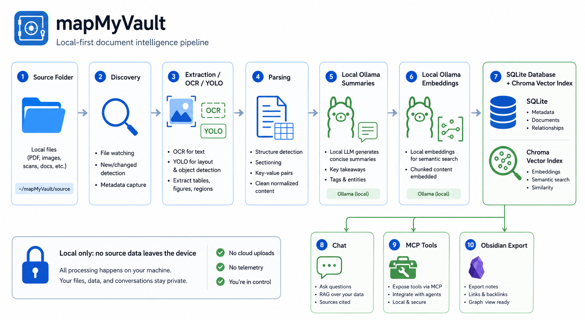

# 🏗️ Architecture

mapMyVault is a local-first indexing and retrieval platform.

It has four main responsibilities:

1. Read local files safely.
2. Persist an inspectable local database.
3. Build derived search, graph, and vault artifacts.
4. Expose local query and action interfaces.

## 🔁 High-Level Flow

If Mermaid does not render in your viewer, use the static image below.

## 🧩 Architecture Diagram

## 🧱 Main Modules

| Module | Role |
|---|---|
| `src/cli.py` | CLI entrypoint for map/resume/query/serve/studio/actions |
| `src/streamlit_app.py` | Streamlit Studio UI |
| `src/mapper.py` | Resumable indexing pipeline |
| `src/analyzer.py` | Scanning, extraction, OCR, YOLO labels, deterministic parsing |
| `src/storage.py` | SQLite schema and persistence |
| `src/vector_index.py` | Chroma vector index wrapper |
| `src/local_ai.py` | Local Ollama generation and embeddings |
| `src/query.py` | Search, count, folder navigation, local answer evidence |
| `src/mcp_server.py` | Local MCP server |
| `src/actions.py` | Approval-gated action plans |
| `src/vault_export.py` | Obsidian Markdown export |
| `src/exporter.py` | Export Obsidian from an existing index |
| `src/doctor.py` | Local readiness checks |
| `src/terminal_ui.py` | Interactive terminal prompts |

## 🛠️ Pipeline Stages

| Stage | What Happens | Stored In |
|---|---|---|
| Discovery | Walk source tree, respect `.gitignore` and exclusions, record file/folder metadata | `files`, `stages` |
| Extraction | Read text from supported files | `files.extracted_text`, `document_metadata_json` |
| OCR | Optional Tesseract OCR for scanned PDFs/images | `files.extracted_text`, `document_metadata_json` |
| Image Vision | Optional local YOLO labels for image files | `files.extracted_text`, `document_metadata_json` |
| Parsing | Extract imports, symbols, links, references | `files.parse_data` |
| Summaries | Local Ollama creates structured file summaries | `files.summary_json`, `data/summaries/` |
| Embeddings | Local Ollama creates vectors | `files.embedding_json`, `data/chroma/` |
| Relationships | Store deterministic and semantic relationships with evidence | `relationships` |
| Graph Export | Write rebuildable graph JSON | `data/graph.json` |
| Search Index | Rebuild SQLite full-text search | `files_fts` |
| Manifest | Record config, versions, endpoints, tools | `data/manifest.json` |

## ♻️ Incremental Behavior

mapMyVault stores stage status per file. A rerun processes only missing, failed, stale, or invalidated work.

Invalidation rules:

- File content change invalidates extraction and downstream stages.
- OCR config change invalidates extraction and downstream stages.
- YOLO config/model change invalidates extraction and downstream stages.
- Summary prompt change invalidates summaries and downstream stages.
- Embedding model change invalidates embeddings and semantic relationships.
- Relationship prompt change invalidates relationship generation.
- Export template change invalidates Obsidian export only.
- Deleted files are soft-deleted and removed from search/vector results.

## 🗄️ Storage Ownership

| Artifact | Owner | Rebuildable? |
|---|---|---|
| `data/index.sqlite` | mapMyVault / SQLite | No, canonical |
| `data/chroma/` | Chroma | Yes |
| `data/graph.json` | Export stage | Yes |
| `data/summaries/` | Summary stage | Yes |
| `obsidian/` | Obsidian export | Yes |
| `data/manifest.json` | Manifest stage | Yes |

SQLite is the source of truth. If derived artifacts are corrupt or stale, they can be rebuilt from SQLite/source files.

## 🔒 Local-Only Boundary

Allowed model/tool endpoints:

- `127.0.0.1`
- `localhost`
- `::1`

Rejected:

- Remote model provider URLs
- Cloud API endpoints
- Non-loopback Ollama URLs

Local components:

- Ollama runs on loopback HTTP.
- MCP runs on loopback HTTP.
- SQLite and Chroma are local files.
- Tesseract, Poppler, PyMuPDF, and YOLO run locally.
- YOLO weights are loaded from local `.pt` files in `models/`.

Manual model downloads are possible, but mapMyVault does not auto-download YOLO weights during indexing.

## 🤖 Model Roles

| Model Type | Used For | Example |
|---|---|---|
| Generation model | Summaries, relationship judgment, chat wording | `llama3.1:8b` |
| Embedding model | Semantic search vectors | `nomic-embed-text` |
| YOLO model | Image object labels | `yolov8n.pt` |

Embedding model consistency matters. Existing indexes should be updated with the same embedding model used originally.

## 📚 Libraries And Frameworks

| Library / Tool | Used For |
|---|---|
| `streamlit` | Local Studio UI |
| `requests` | Local Ollama HTTP calls |
| `pydantic` | Structured LLM output validation |
| `sqlite3` | Canonical local database |
| `chromadb` | Persistent local vector index |
| `networkx` | Graph export support |
| `mcp` | Local MCP server |
| `inquirer` | Interactive terminal prompts |
| `tqdm` | CLI progress bars |
| `pathspec` | `.gitignore` and exclusion matching |
| `pypdf` | PDF text extraction |
| `python-docx` | DOCX extraction |
| `openpyxl` | XLSX extraction |
| `python-pptx` | PPTX extraction |
| `pytesseract` | OCR bridge to Tesseract |
| `pdf2image` | PDF page rasterization via Poppler |
| `PyMuPDF` | Fallback PDF renderer |
| `Pillow` | Image loading and metadata |
| `ultralytics` | Optional local YOLO object detection |
| `yake` | Keyword extraction |
| `nltk` | Stopword support |
